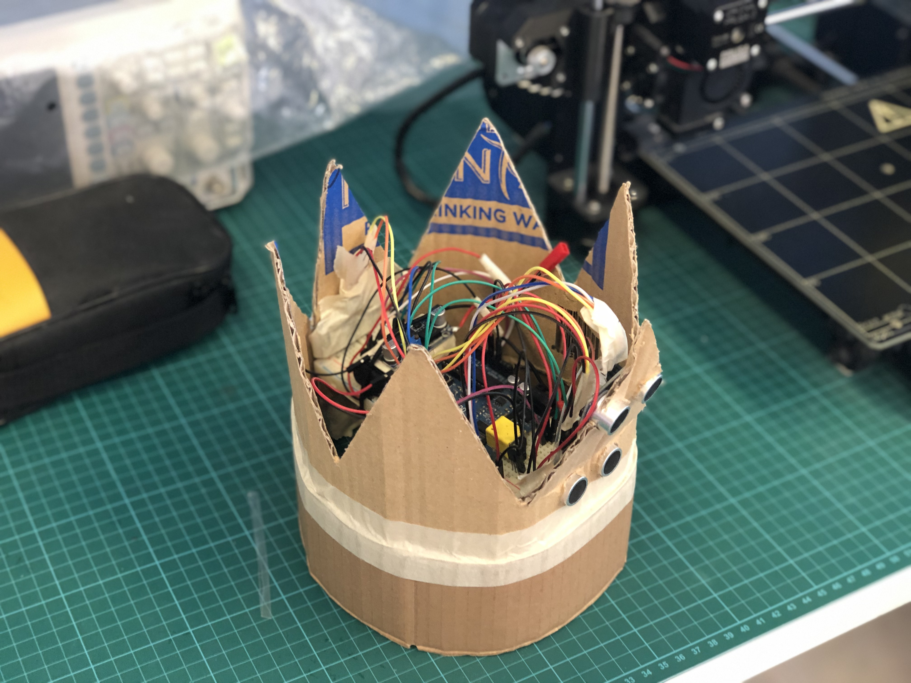

# spideysense

## Inspiration
Currently, visually impaired people use a [white cane](https://en.wikipedia.org/wiki/White_cane) to scan their surroundings and identify obstacles in their way. The white colour also serves as a universal identifier for others around them. However, we did not like that a cane completely occupies one of the user's hands. If we can free up this hand, a visually impaired person can do so much more, like hold groceries or their child's hand as they walk. 

## What it does
The crown has ultrasonic sensors pointed forward and backward to detect the proximity to a wall ahead or behind the user. When there is a wall less than 2 meters away, vibrator motors in the crown pulse to provide haptic feedback to the user, scaling in intensity the closer the user gets to an obstacle.

There is also a third sensor pointed downwards at an angle in front of the user. This sensor is pegged to the height of the user, and can detect if there are stairs, up or down, ahead. It can also detect low height obstacles like tables or fire hydrants. 

Lastly, we built all the parts into the shape of a crown. This serves the same purpose as the white colour of the white cane, identifying the user to others around them that they are visually impaired.

## How we built it
The ultrasonic sensors (HC-SR04) and haptic feedback vibrator motors are attached and controlled by an Arduino mounted inside the crown. The system is currently powered by a battery and is not tethered to anything else.

## Challenges we ran into
The PWM control of the vibrator motors only control the strength of the vibration. However, the difference in strength is not very discernible to the touch of a user. Hence we sought to pulse the vibration motor such that the difference between the maximum and minimum strength is very clear to the user. The minimum strength is now roughly a pulse every second, and maximum a constant vibration. 

Scheduling the pulse frequency of the vibrator motors and sampling of the ultrasonic sensors on the Arduino, is complicated to manage as the timer interrupts need to be used by the ultrasonic sensors and the pulsing logic simultaneously. Therefore, we had to come up with a single loop scheduling mechanism which seems to sufficiently simulate the pulses without any hardware timer use at all.

## Accomplishments that we're proud of
Being able to use technology to improve the lives of people in our society that are disadvantaged. 

## What we learned
The technology used can be very straightforward, common and affordable, and yet have a massive impact on the lives of its users.

## What's next for Spidey Sense
Replacing the cardboard frame with something more durable, comfortable and secure, as well as making the electronics into a permanent PCB to make the wiring more reliable. We also envision a design where the crown is collapsible sideways so the entire system can fit easily in a bag. We also would like to switch to a better 32bit ARM based micro-controller, such that there are more hardware timers and scheduling become a non-issue. Lastly, an auto calibration for the height of the user using can also be done using the front 2 sensors.
